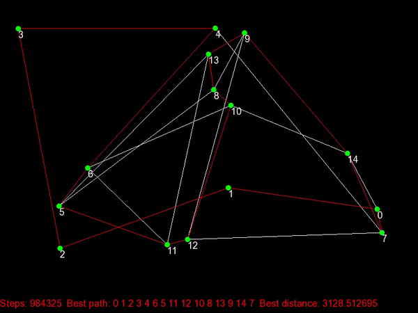
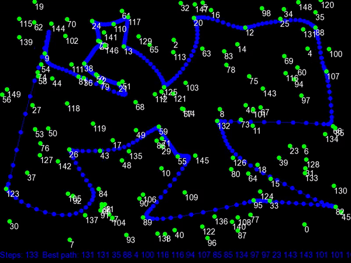

# Travelling Salesman Problem with Visualization

The [travelling salesman problem (TSP)](https://en.wikipedia.org/wiki/Travelling_salesman_problem) is a classical optimization problem. Here different methods to solve it are implemented and visualized.

## Different solutions to the problem
  ### Brute force
  This method consist on checking all the possible paths, which are all possible undirected circular graphs, considering the cities as graph nodes. The number of permutations grows factorially with the number of cities. Number of permutations: (number of cities - 1)!/2. Therefore, for more than 20 cities this method becomes impractical.
  ### Self Organizing Maps (SOM)
  The [SOM](https://en.wikipedia.org/wiki/Self-organizing_map) is an unsupervised machine learning method which adaps to the structure of the given data. A SOM with circular structure can be used to find a solution for the TSP.
  
## Visualization of the solving process using SFML in C++
  - Brute force:<br/>
	
  - Self Organizing Maps:<br/>
	
	
## Usage
Build the binary running the **build.sh** script.<br/>

```console
Usage: TSP [-m solving method] [-r number_of_cities || -f csv_path]
 -m : Method to solve the problem.
      bf -> brute force
      som -> Self Organizing maps
 -r : Random generated cities. Number of cities to generate.
 -f : Load cities from file. Path to the csv file.
 ```
